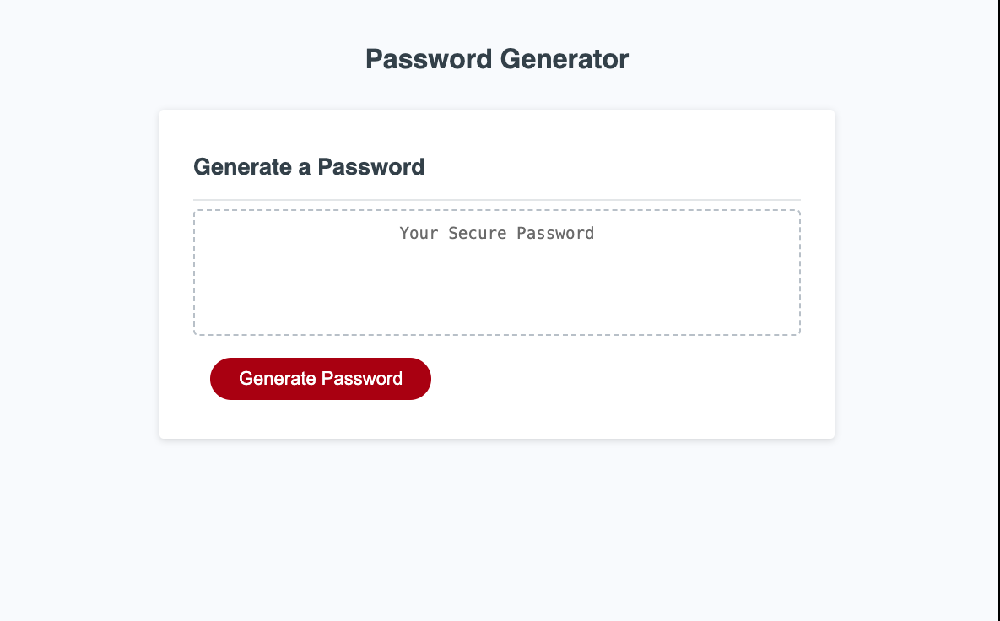

# Super Password Generator
* It is an app that allows users to generate a password using between 8 - 128 characters.
* You can choose between lowercase characters, uppercase characters, number characters, special characters, that will be assigned ramndonly. 
* At least one character type should be selected

## Screenshot of the app
! 

### References used
* https://www.w3schools.com/
* https://developer.mozilla.org/en-US/
* code from class
* Debugging help from Walter Perry
